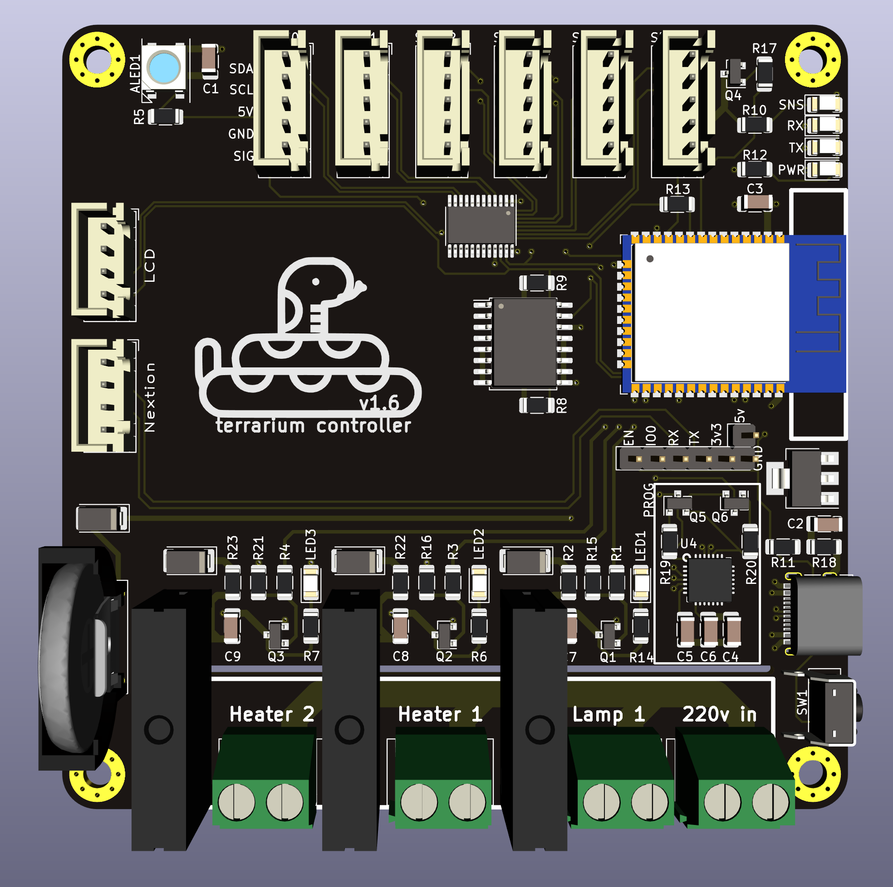
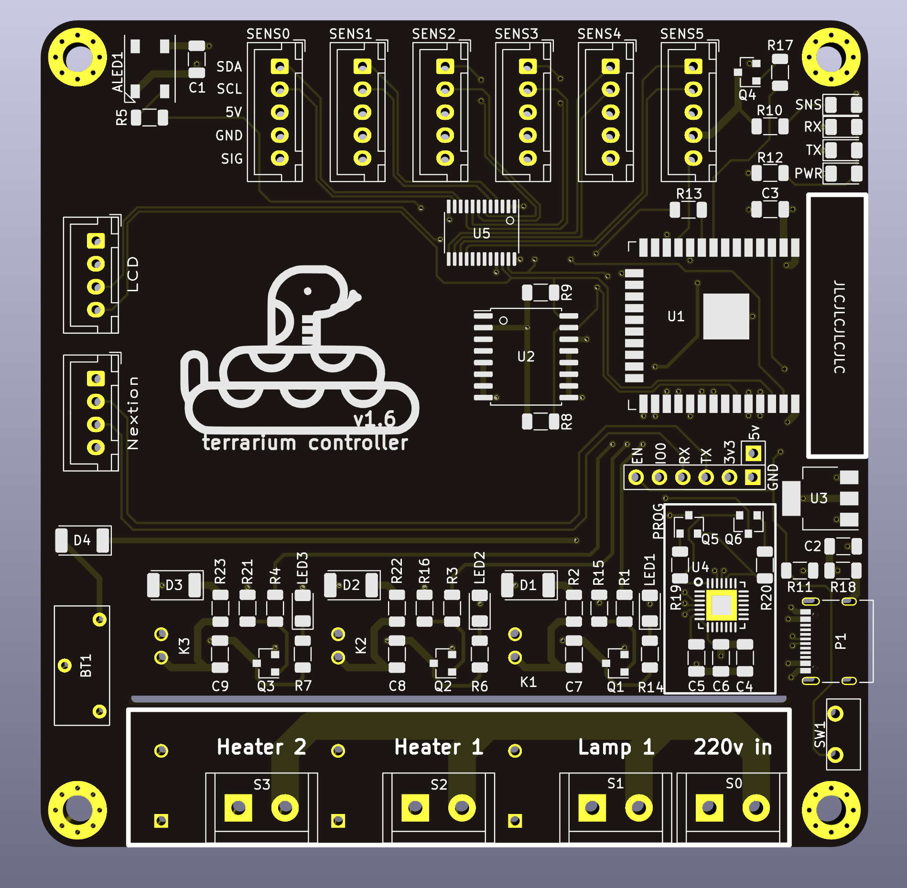

# ESP32 based terrarium controller

This controller is built for terrariums with reptiles to maintain a given temperature during the day and the night.
## Features
- ESP32 WROOM 32
- 6 x 5v i2c & 1wire sensors
- 3 x 5v SSR 
- i2c LCD
- i2c RTC DS3231M
- i2c multiplexer TCA9548APWR
- cp2102 USB to UART
- usb-c for power and flashing

# Images

